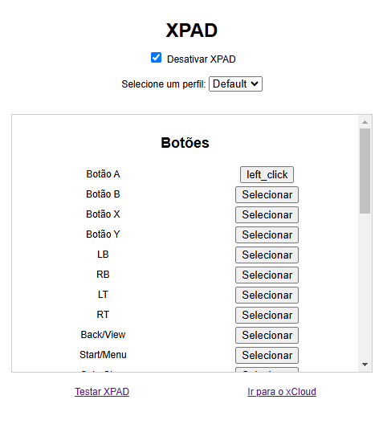

# 🎮 XPAD: Xbox Controller Emulator for XCLOUD 🎮  

XPAD é uma extensão de navegador que emula um controle de Xbox, permitindo que você jogue no **XCLOUD** com teclado e mouse! Personalize os controles, teste e jogue diretamente na plataforma de streaming de games da Microsoft.  

---

## 🖼️ Interface  

Aqui está uma prévia da interface da extensão:  

  

---

## 🚀 Funcionalidades  

- 🕹️ Emulação completa do controle de Xbox.  
- 🖱️ Personalização de teclas e cliques do mouse para os botões do controle.  
- 🌐 Funciona diretamente no navegador, sem configurações complicadas.  
- ✅ Teste os mapeamentos antes de entrar no XCLOUD.  

---

## 🛠️ Como Usar  

### Instalação  

1. Faça o download deste repositório.  
2. Abra o navegador e vá para as **Extensões** (chrome://extensions no Chrome).  
3. Ative o **Modo Desenvolvedor**.  
4. Clique em **Carregar sem compactação** e selecione a pasta do projeto.  
5. Pronto! A extensão estará instalada.  

---

### Configuração  

1. Abra a extensão XPAD no navegador.  
2. Configure os botões de acordo com sua preferência.  
3. Teste os mapeamentos usando o botão **Testar XPAD**.  
4. Clique em **Ir para o xCloud** para começar a jogar!  

---

## 🔧 Contribuindo  

Quer contribuir? Fique à vontade!  

1. Faça um **fork** deste repositório.  
2. Crie uma nova branch (`git checkout -b feature/minha-feature`).  
3. Envie suas alterações (`git commit -am 'Adicionei minha feature'`).  
4. Suba sua branch (`git push origin feature/minha-feature`).  
5. Abra um **Pull Request**.  

---

## 📑 Licença  

Este projeto é licenciado sob a **MIT License**.  

---